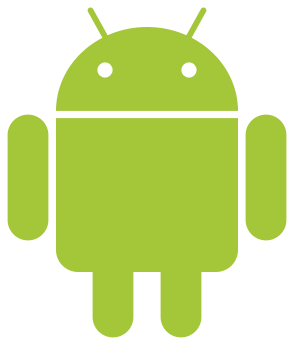

# cordova-plugin-calendar-continued

[)](https://npmjs.com/package/cordova-plugin-calendar-continued)
[)](https://github.com/GitToTheHub/cordova-plugin-calendar-continued)

This plugin allows you to add events to the Calendar of the mobile device.

> [!NOTE]
> This is a fork of the [Calendar-PhoneGap-Plugin](https://github.com/EddyVerbruggen/Calendar-PhoneGap-Plugin) by [EddyVerbruggen](https://github.com/EddyVerbruggen), which will continue the support of this plugin to the community. If you like, you can support me on my [GitHub Sponsor page](https://github.com/sponsors/GitToTheHub).

## iOS Specifics

### Calendar Usage Description

You need to provide a reason to the user for Calendar access. This plugin adds the key `NSCalendarsUsageDescription` to your App's Info.plist with the default text `This app uses your calendar`, which you can override with the preference key `CALENDAR_USAGE_DESCRIPTION`. To do so, pass the following variable when installing the plugin:

```bash
cordova plugin add cordova-plugin-calendar-continued --variable CALENDAR_USAGE_DESCRIPTION="My custom calendar usage reason"
```

### Contacts usage description

You need to provide a reason to the user for contacts access. This is needed in some iOS versions when searching for locations and invitees using the interactive mode like `createEventInteractively`. This plugin adds the key `NSContactsUsageDescription` to your App's Info.plist with the defaul text `This app uses contacts when searching for locations and invitees when using the calendar functionality`, which you can override with the preference key `CONTACTS_USAGE_DESCRIPTION`. To do so, pass the following variable when installing the plugin:

```bash
cordova plugin add cordova-plugin-calendar-continued --variable CONTACTS_USAGE_DESCRIPTION="My custom contacts usage reason"
```

## Android Specifics

### Android Permissions

Since Android 6 permissions need to be requested to use the Calendar at runtime when targeting API level 23+. Since plugin version 4.5.0 this is handled automatically in a just-in-time manner. If you call `createEvent` the plugin will pop up a permission dialog, after the user granted access to his calendar the event will be created.

You can also manually manage and check permissions if that's your thing.
Note that the `hasPermission` functions will return `true` when:

- You're running on iOS
- You're targeting on Android an API level lower than 23 (Android 6)
- You've already granted permission.

```js
  function hasReadWritePermission() {
    window.plugins.calendar.hasReadWritePermission(
      function(result) {
        // if this is 'false' you probably want to call 'requestReadWritePermission' now
        alert(result);
      }
    )
  }

  function requestReadWritePermission() {
    // no callbacks required as this opens a popup which returns async
    window.plugins.calendar.requestReadWritePermission();
  }
```

There are similar methods for Read and Write access only (`hasReadPermission`, etc),
although it looks like that if you request read permission you can write as well,
so you might as well stick with the example above.

Note that backward compatibility was added by checking for read or write permission in the relevant plugins functions.
If permission is needed the plugin will now show the permission request popup.
The user will then need to allow access and invoke the same method again after doing so.

## Installation

From npm (Release version):

```bash
cordova plugin add cordova-plugin-calendar-continued
```

From GitHub (Development version):

```bash
cordova plugin add https://github.com/GitToTheHub/cordova-plugin-calendar-continued
```

## Usage

### Calendar Methods

These methods are for handling a calendar itself and not the events on it.

| Method | Support |
| ---    | ---     |
| [createCalendar](#create-calendar) |  |
| [deleteCalendar](#delete-calendar) |  |
| [listCalendars](#list-calendars) |  |
| [openCalendar](#open-calendar-app) |  |

#### Create Calendar

The `createCalendar` method will take as its first parameter a calender name or an options object.

##### Create Calendar Just By Name

```js
  window.plugins.calendar.createCalendar(
    "My Calendar Name"
    (result) => {
      // If the calendar did not exists, the result will be the calendar id,
      // otherwise it will contain the message "OK, Calendar already exists" on iOS and
      // on Android it will be "null".
      // On Android the calendar id will be an int like 1, on iOS it will return an UUID
      // like "C50FED73-B77E-4DEF-91C2-5DA4E5191162"
      console.log(`Calendar created, result=${result}`)
    }),
    (errorMessage)=> {
      console.error(`Error creating calendar: ${errorMessage}`)
    }))
```

##### Create Calendar By Options

```js
  const createCalOptions = window.plugins.calendar.getCreateCalendarOptions()
  // Android: Set the local account name where the local calendar is created under.
  // If you don't set it, the app name will be used as account name.
  createCalOptions.accountName = "My Account name"
  // The calendar name, Android and iOS
  createCalOptions.calendarName = "My Calendar Name"
  // Optional, set the calendar color by a hex color like `#FF0000"`, default is null, so the OS picks a color.
  createCalOptions.calendarColor = "#FF0000"

  // Create a calendar with options
  window.plugins.calendar.createCalendar(
    createCalOptions,
    (result) => {
      // If the calendar did not exists, the result will be the calendar id,
      // otherwise it will contain the message "OK, Calendar already exists" on iOS and
      // on Android it will be "null".
      // On Android the calendar id will be an int like 1, on iOS it will return an UUID
      // like "C50FED73-B77E-4DEF-91C2-5DA4E5191162"
      console.log(`Calendar created, result=${result}`)
    }),
    (errorMessage)=> {
      console.error(`Error creating calendar, errorMessage=${errorMessage}`);
    }))
```

##### Android Specifics

Under Android a local calendar will be created in a local account which geht not synced.
The success callback will deliver the calendar id, which can be used on Android to create the event on it.

#### Delete Calendar

```js
window.plugins.calendar.deleteCalendar(
  "My Calendar Name", 
  (message) => {
    console.log(`Calender deleted successfully, message=${message}`)
  },
  (errorMessage) => {
    console.log(`Error during deleting calendar, errorMessage=${errorMessage}`)
  })
```

#### List Calendars

Get a list of all calendars.

```js
window.plugins.calendar.listCalendars(
  // The success callback will return an Array of calendar objects.
  // A calendar object will be something like `{"id":"1", "name":"first"}`
  (calendars) => {
    console.log(`Successfully could get list of calendars, calendars=${JSON.stringify(calendars)}`)
  },
  (errorMessage) => {
    console.error(`Could not get list of calendars, errorMessage=${errorMessage}`)
  })
```

#### Open Calendar App

```js
  // Opens it at 'today'
  window.plugins.calendar.openCalendar()

  // Opens it at a specific date, here today + 3 days
  // Callbacks are optional
  const date = new Date(new Date().getTime() + 3 * 24 * 60 * 60 * 1000)
  window.plugins.calendar.openCalendar(date, success, error)
```

### Event Methods

These methods are for handling the calendar events.

| Method | Support |
| ---    | ---     |
| createEvent                         |  |
| createEventWithOptions              |  |
| createEventInteractively            |  |
| createEventInteractivelyWithOptions |  |
| findEvent                           |  |
| findEventWithOptions                |  |
| listEventsInRange                   |  |
| findAllEventsInNamedCalendars       |  |
| modifyEvent                         |  |
| modifyEventWithOptions              |  |
| deleteEvent                         |  |
| deleteEventFromNamedCalendar        |  |
| deleteEventById                     |  |

#### Examples

```js
  // Common successCallback for examples
  const success = (response) => {
    console.log(`Success, response=${JSON.stringify(response)}`);
  }

  // Common errorCallback for examples
  const error = (errorMessage) => {
    console.error(`Error, errorMessage=${errorMessage}`);
  }

  // Prepare some variables for event creation
  // Beware: First Month = 0, Last Month = 11
  const startDate = new Date(2026, 8, 15, 18, 30, 0, 0, 0);
  const endDate = new Date(2026, 8, 15, 19, 30, 0, 0, 0);
  const title = "My nice event";
  const eventLocation = "Home";
  const notes = "Some notes about this event.";

  // create an event silently
  window.plugins.calendar.createEvent(
    title, eventLocation, notes, startDate, endDate, success, error
  );

  // create an event silently with options:
  const calOptions = window.plugins.calendar.getCalendarOptions(); // grab the defaults
  calOptions.firstReminderMinutes = 120; // default is 60, pass in null for no reminder (alarm)
  calOptions.secondReminderMinutes = 5;
  calOptions.recurrence = "monthly"; // supported are: daily, weekly, monthly, yearly
  calOptions.recurrenceInterval = 2; // once every 2 months in this case, default: 1
  calOptions.recurrenceEndDate = new Date(2027,10,1,0,0,0,0,0); // leave null to add events into infinity and beyond
  // Select calendar for the event. This differs on Android and iOS
  // iOS: You can choose the calendar by name. If not set a default calendar will be used.
  calOptions.calendarName = "My Calendar Name";
  // Android: You have to set the calendar id, where to store the event. If not set, it defaults to 1 (what ever this will be).
  // You get the calendar id, when you create a calendar in the success callback, otherwise you can use window.plugins.calendar.listCalendars
  // to get a calendar id.
  calOptions.calendarId = 1;

  // And the URL can be passed (will be appended to the notes on Android as there doesn't seem to be a sep field)
  calOptions.url = "https://www.google.com";

  window.plugins.calendar.createEventWithOptions(
    title, eventLocation, notes, startDate, endDate, calOptions,
    (eventId) => {
        // On Android this will be an int like `1`.
        // On iOS this will be a calendar/event identifier string
        // containing UUID segments like:
        // `B12B87C3-6721-4FE7-AE1C-B71600B09AB7:9C9E6CF8-3335-4A7D-B81F-C0ED34B7B54D`
        console.log(`Event created with options, eventId=${eventId}`);
    },
    (errorMessage) => {
        console.error(`Error creating event with options, errorMessage=${errorMessage}`);
    }
  );

  // create an event interactively
  window.plugins.calendar.createEventInteractively(title, eventLocation, notes, startDate, endDate, success, error);

  // create an event interactively with the calOptions object as shown above
  window.plugins.calendar.createEventInteractivelyWithOptions(title, eventLocation, notes, startDate, endDate, calOptions, success, error);

  // create an event in a named calendar (iOS only, deprecated, use createEventWithOptions instead)
  window.plugins.calendar.createEventInNamedCalendar(title, eventLocation, notes, startDate, endDate, calendarName, success, error);

  // find events (on iOS this includes a list of attendees (if any))
  window.plugins.calendar.findEvent(title, eventLocation, notes, startDate, endDate, success, error);

  // if you need to find events in a specific calendar, use this one. All options are currently ignored when finding events, except for the calendarName.
  var calOptions = window.plugins.calendar.getCalendarOptions();
  calOptions.calendarName = "My Calendar Name"; // iOS only
  calOptions.id = "D9B1D85E-1182-458D-B110-4425F17819F1"; // if not found, we try matching against title, etc
  window.plugins.calendar.findEventWithOptions(title, eventLocation, notes, startDate, endDate, calOptions, success, error);

  // list all events in a date range (only supported on Android for now)
  window.plugins.calendar.listEventsInRange(startDate, endDate, success, error);

  // find all _future_ events in the first calendar with the specified name (iOS only for now, this includes a list of attendees (if any))
  window.plugins.calendar.findAllEventsInNamedCalendar(calendarName, success, error);

  // change an event (iOS only for now)
  var newTitle = "New title!";
  window.plugins.calendar.modifyEvent(title, eventLocation notes, startDate, endDate, newTitle, eventLocation, notes, startDate, endDate, success, error);

  // or to add a reminder, make it recurring, change the calendar, or the url, use this one:
  var filterOptions = window.plugins.calendar.getCalendarOptions(); // or {} or null for the defaults
  filterOptions.calendarName = "My Calendar Name"; // iOS only
  filterOptions.id = "D9B1D85E-1182-458D-B110-4425F17819F1"; // iOS only, get it from createEventWithOptions (if not found, we try matching against title, etc)
  var newOptions = window.plugins.calendar.getCalendarOptions();
  newOptions.calendaName = "My Changed Calendar Name"; // make sure this calendar exists before moving the event to it
  // not passing in reminders will wipe them from the event. To wipe the default first reminder (60), set it to null.
  newOptions.firstReminderMinutes = 120;
  window.plugins.calendar.modifyEventWithOptions(title, eventLocation, notes, startDate, endDate, newTitle, eventLocation, notes, startDate, endDate, filterOptions, newOptions, success, error);

  // delete an event (you can pass nulls for irrelevant parameters). The dates are mandatory and represent a date range to delete events in.
  // note that on iOS there is a bug where the timespan must not be larger than 4 years, see issue 102 for details.. call this method multiple times if need be
  // You can match events starting with a prefix title, so if your event title is 'My app - cool event' then 'My app -' will match.
  window.plugins.calendar.deleteEvent(newTitle, eventLocation, notes, startDate, endDate, success, error);

  // delete an event, as above, but for a specific calendar (iOS only)
  window.plugins.calendar.deleteEventFromNamedCalendar(newTitle, eventLocation, notes, startDate, endDate, calendarName, success, error);

  // Delete an event by id.
  // fromDate is optional and can be null. If the event has recurring instances,
  // all will be deleted unless fromDate is specified, which will
  // delete from that date onward.
  window.plugins.calendar.deleteEventById(
    eventId,
    fromDate,
    success, error
  );
```

Creating an all day event

```js
// set the startdate to midnight and set the enddate to midnight the next day
const startDate = new Date(2027, 2, 15, 0, 0, 0, 0, 0)
const endDate = new Date(2027, 2, 16, 0, 0, 0, 0, 0)
```

Creating an event for 3 full days

```js
// set the startdate to midnight and set the enddate to midnight 3 days later
const startDate = new Date(2027, 2, 24, 0, 0, 0, 0, 0)
const endDate = new Date(2027, 2, 27, 0, 0, 0, 0, 0)
```

Example Response IOS getCalendarOptions

```js
{
  calendarId: null,
  calendarName: "calendar",
  firstReminderMinutes: 60,
  recurrence: null,
  recurrenceEndDate: null,
  recurrenceInterval: 1,
  secondReminderMinutes: null,
  url: null
}
```

Example Response IOS Calendars

```js
{
  id: "258B0D99-394C-4189-9250-9488F75B399D",
  name: "standard calendar",
  type: "Local"
}
```

Example Response IOS Event

```js
{
  calendar: "Kalender",
  endDate: "2016-06-10 23:59:59",
  id: "0F9990EB-05A7-40DB-B082-424A85B59F90",
  lastModifiedDate: "2016-06-13 09:14:02",
  location: "",
  message: "my description",
  startDate: "2016-06-10 00:00:00",
  title: "myEvent"
}
```

## Promises

If you like to use promises instead of callbacks, or struggle to create a lot of
events asynchronously with this plugin then I encourage you to take a look at
[this awesome wrapper](https://github.com/poetic-labs/native-calender-api) for
this plugin. Kudos to [John Rodney](https://github.com/JohnRodney) for this piece of art!

## Credits

This plugin was enhanced for Plugman / PhoneGap Build by [Eddy Verbruggen](http://www.x-services.nl). I fixed some issues in the native code (mainly for iOS) and changed the JS-Native functions a little in order to make a universal JS API for both platforms.
* Inspired by [this nice blog of Devgirl](http://devgirl.org/2013/07/17/tutorial-how-to-write-a-phonegap-plugin-for-android/).
* Credits for the original iOS code go to [Felix Montanez](https://github.com/felixactv8/Phonegap-Calendar-Plugin-ios).
* Credits for the original Android code go to [Ten Forward Consulting](https://github.com/tenforwardconsulting/Phonegap-Calendar-Plugin-android) and [twistandshout](https://github.com/twistandshout/phonegap-calendar-plugin).
* Special thanks to [four32c.com](http://four32c.com) for sponsoring part of the implementation, while keeping the plugin opensource.

## License

[The MIT License (MIT)](http://www.opensource.org/licenses/mit-license.html)

Permission is hereby granted, free of charge, to any person obtaining a copy
of this software and associated documentation files (the "Software"), to deal
in the Software without restriction, including without limitation the rights
to use, copy, modify, merge, publish, distribute, sublicense, and/or sell
copies of the Software, and to permit persons to whom the Software is
furnished to do so, subject to the following conditions:

The above copyright notice and this permission notice shall be included in
all copies or substantial portions of the Software.

THE SOFTWARE IS PROVIDED "AS IS", WITHOUT WARRANTY OF ANY KIND, EXPRESS OR
IMPLIED, INCLUDING BUT NOT LIMITED TO THE WARRANTIES OF MERCHANTABILITY,
FITNESS FOR A PARTICULAR PURPOSE AND NONINFRINGEMENT. IN NO EVENT SHALL THE
AUTHORS OR COPYRIGHT HOLDERS BE LIABLE FOR ANY CLAIM, DAMAGES OR OTHER
LIABILITY, WHETHER IN AN ACTION OF CONTRACT, TORT OR OTHERWISE, ARISING FROM,
OUT OF OR IN CONNECTION WITH THE SOFTWARE OR THE USE OR OTHER DEALINGS IN
THE SOFTWARE.
